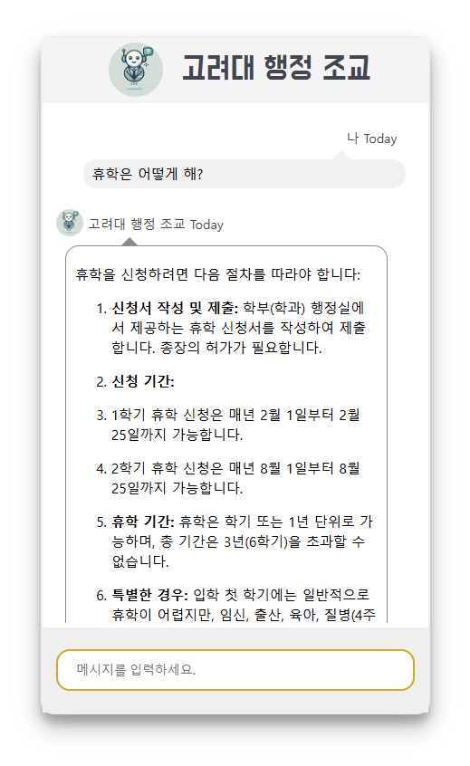

# -
학교 행정 조교 처럼 작동하는 챗봇 웹페이지와 카카오톡 챗봇을 구동하는 서버를 만드는 프로그램입니다.

아래 사진은 실제로 서버를 구현하여 웹페이지에서 실행한 결과입니다.

고려대학교 컴퓨터융합소프트웨어학과 캡스톤디자인2 과목을 수강하는 OCB Team의 일원 문선웅 학생입니다.

OCB Team은 김채원, 정규환, 김주하, 문선웅 학생으로 이루어져 있고,

고려대학교의 많은 학생들이 우리가 만든 챗봇을 통해 학사 운영 규정을 쉽게 알아볼 수 있도록 웹페이지와 카카오톡으로 챗봇 서버를 구동하는 프로그램을 만들기로 했습니다.

